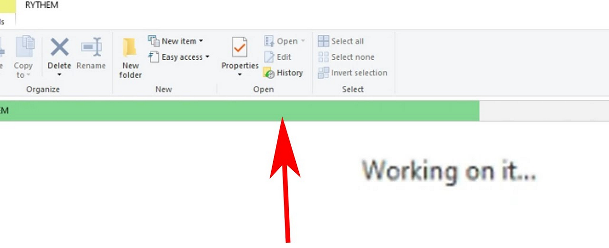
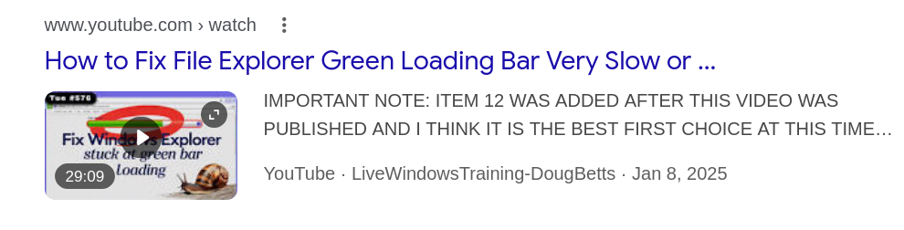
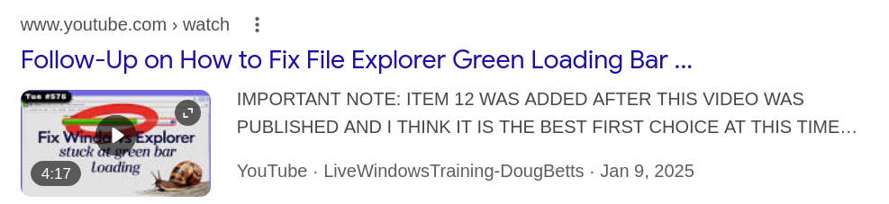
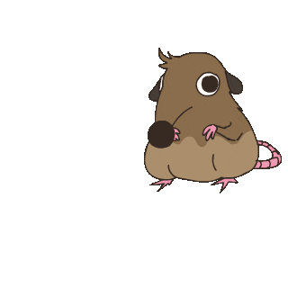
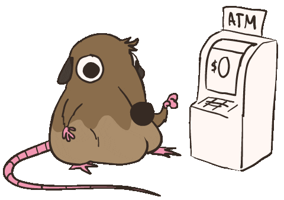

---
theme:
  name: tokyonight-storm
  override:
    footer:
      style: template
      left: "@orhundev"
      right: ""
---


<!-- no_footer -->

<!-- end_slide -->

<!-- alignment: center -->


THE ULTIMATE  
**Terminal Survival Guide**

---

**Orhun Parmaksız**

🐀

<!-- no_footer -->

<!-- end_slide -->

## Questions


<!-- alignment: center -->

<!-- pause -->

How many of you use the terminal?

<!-- pause -->

How many of you do open source?

<!-- pause -->

How many of you use Rust?

<!-- pause -->

How many of you know about `Ratatui`?

<!-- end_slide -->

<!-- column_layout: [1, 1] -->

<!-- column: 0 -->


<!-- column: 1 -->

<!-- new_lines: 2 -->

# **Orhun Parmaksız**

⚡ Open Source Developer

🦀 _Open source, Rust and terminals!_

🐭 Lead maintainer @ **Ratatui**

📦 Maintainer @ **Arch Linux** (btw)

---

`https://github.com/orhun`  
`https://youtube.com/@orhundev`

<!-- end_slide -->


<!-- no_footer -->

<!-- end_slide -->

<!-- new_lines: 3 -->

<!-- column_layout: [1, 1]-->

<!-- column: 0 -->


<!-- column: 1 -->


<!-- no_footer -->

<!-- end_slide -->

<!-- alignment: center -->

<!-- new_lines: 2 -->

ok...

<!-- pause -->

**Imagine a rat.**

<!-- pause -->


<!-- pause -->

_rat wants to download MP3_

<!-- pause -->

_rat goes to ytmp3downloader.cc_

<!-- no_footer -->

<!-- end_slide -->


<!-- pause -->

<!-- jump_to_middle -->


<!-- alignment: center -->

<!-- no_footer -->

<!-- end_slide -->

<!-- no_footer -->

<!-- alignment: center -->

<!-- new_lines: 3 -->

**Imagine a rat (again)**


<!-- pause -->

_rat wants to find the `cheese.txt`_

<!-- pause -->

_rat uses file search_

<!-- end_slide -->

<!-- no_footer -->



<!-- pause -->



<!-- pause -->



<!-- pause -->

<!-- jump_to_middle -->


<!-- end_slide -->

<!-- alignment: center -->

<!-- new_lines: 3 -->

<!-- no_footer -->

**Imagine a rat (sorry)**


<!-- pause -->

_rat wants to monitor network traffic_

<!-- pause -->

_rat runs a GUI tool_

<!-- pause -->

<!-- end_slide -->

<!-- no_footer -->


<!-- pause -->

```bash +exec
wireshark
```

<!-- end_slide -->



<!-- alignment: center -->

_rat explodes._

<!-- no_footer -->

<!-- end_slide -->

<!-- jump_to_middle -->

<!-- alignment: center -->

Solution?

<!-- no_footer -->

<!-- end_slide -->

<!-- column_layout: [2, 2, 4, 2] -->

<!-- column: 1 -->

<!-- jump_to_middle -->

**THE TERMINAL █**

<!-- column: 2 -->

<!-- new_lines: 6 -->


<!-- no_footer -->

<!-- end_slide -->


<!-- pause -->

```sh +exec
rio
```

<!-- end_slide -->

### It's almost 2026, why still terminal?

<!-- pause -->

---

<!-- column_layout: [3, 2] -->

<!-- column: 1 -->

<!-- new_lines: 2-->


<!-- column: 0 -->

#### Timelessness

- Works the same across decades

<!-- pause -->

#### Powerful

- Your workflow, your rules
- Scripting & automation
- Endless possibilities

<!-- pause -->

#### Efficient

- Low power usage
- Runs on a potato

<!-- pause -->

<!-- reset_layout -->

<!-- column_layout: [1, 10] -->

<!-- column: 1 -->

> "Make the machine do exactly what you want with minimal friction"

<!-- end_slide -->

<!-- jump_to_middle -->

Terminal is the past, present and future. █

<!-- pause -->

<!-- alignment: right -->

_how do I download MP3 tho_?

<!-- pause -->

<!-- alignment: left -->

ah, right!

<!-- end_slide -->

Downloading MP3:

```bash
$ yt-dlp -f bestaudio --extract-audio --audio-format mp3
```

<!-- pause -->

Searching files:

```bash +exec +acquire_terminal
ig 'fn main' /home/orhun/gh/
```

<!-- pause -->

Monitoring network:

```sh +exec +acquire_terminal
sudo oryx -i wlp3s0
```

<!-- end_slide -->


<!-- alignment: center -->

Wait... what was that? That wasn't a normal command.

<!-- pause -->

```bash +exec +acquire_terminal
htop
```

<!-- pause -->

_You run that and it shows an UI?_

<!-- pause -->

Yes, it's called a `Terminal User Interface (TUI)` ✨

<!-- end_slide -->

```svgbob
        0     1     2     3     4     5
     ┌─────┬─────┬─────┬─────┬─────┬─────┐
   0 │  A  │  n  │  k  │  a  │  r  │  a  │
     ├─────┼─────┼─────┼─────┼─────┼─────┤
   1 │     │     │     │  ▲  │     │     │
     └─────┴─────┴─────┴─ │ ─┴─────┴─────┘
                          │
                   ┌──────┴──────┐
                   │   symbol    │
                   │     "a"     │
                   └─────────────┘
```

<!-- alignment: center -->

<!-- pause -->

Unicode connecting blocks:

```
                  ─ │ ┌ ┐ └ ┘
                  ├ ┤ ┬ ┴ ┼
                  ╭ ╮ ╰ ╯
                  ▶ ▼
```

<!-- end_slide -->

```bash +exec +acquire_terminal
ghostty -e kmon
```

<!-- pause -->

```bash +exec
handlr open https://www.compart.com/en/unicode/U+2500
```

<!-- alignment: center -->

- `━` U+2501 heavy horizontal

- `┃` U+2503 heavy vertical

- `┏` `┓` `┗` `┛` heavy corners

<!-- pause -->

---

Ok cool, but how do we build these TUIs?

<!-- end_slide -->

<!-- new_lines: 2 -->


<!-- no_footer -->

<!-- end_slide -->


<!-- end_slide -->


<!-- alignment: center -->

**https://ratatui.rs**

<!-- pause -->

> Ratatui is a Rust library for cooking up terminal user interfaces (TUIs).

- Been around since `2023` (fork of `tui-rs`)

- `250+` contributors, hundreds of apps, `14M+` crate downloads

- `tokio-console`, `yazi`, `dioxus-cli`, `atuin`, `gitui` & more

- Used by `Netflix`, `OpenAI`, `OVHcloud` & many more

<!-- pause -->

```bash +exec
handlr open https://ratatui.ling.ooo
```

<!-- end_slide -->

```bash +exec +acquire_terminal
cargo run --manifest-path ratatui/examples/apps/demo2/Cargo.toml
```

<!-- end_slide -->

# Example TUI

<!-- alignment: center -->


[](https://github.com/Julien-cpsn/ATAC)

<!-- end_slide -->

# Example TUI

<!-- alignment: center -->


[](https://github.com/MAIF/yozefu)

<!-- end_slide -->

<!-- new_lines: 4 -->

<!-- alignment: center -->

### Survival Tips


<!-- no_footer -->

<!-- end_slide -->

# View docx files quickly

<!-- pause -->

```bash +exec +acquire_terminal
doxx assets/report.docx
```

<!-- alignment: center -->

[](https://github.com/bgreenwell/doxx)

<!-- end_slide -->

# Connect to databases

<!-- pause -->


<!-- alignment: center -->

[](https://github.com/achristmascarl/rainfrog)

<!-- end_slide -->

# Take notes

<!-- pause -->

```bash +exec +acquire_terminal
tjournal
```

<!-- alignment: center -->

[](https://github.com/AmmarAbouZor/tui-journal)

<!-- pause -->

<!-- alignment: left -->

```bash +exec +acquire_terminal
taskim
```

<!-- alignment: center -->

[](https://github.com/RohanAdwankar/taskim)

<!-- end_slide -->

# Scan for networks

<!-- pause -->

```bash +exec +acquire_terminal
sudo netscanner
```

<!-- alignment: center -->

[](https://github.com/Chleba/netscanner)

<!-- end_slide -->

# Play music

<!-- pause -->

```bash +exec
mpv assets/concertus.mp4
```

<!-- alignment: center -->

[](https://github.com/Jaxx497/concertus)

<!-- end_slide -->

# Bored?

<!-- pause -->

<!-- alignment: center -->

```bash +exec +acquire_terminal
rebels-in-the-sky
```

<!-- alignment: center -->

Spacepirates playing basketball across the galaxy

[](https://github.com/ricott1/rebels-in-the-sky)

<!-- pause -->

---

```bash +exec +acquire_terminal
ttysvr maze
```

<!-- end_slide -->

<!-- new_lines: 3 -->

<!-- alignment: center -->

You get the idea...


Check out `https://github.com/ratatui/awesome-ratatui` for more!

<!-- no_footer -->

<!-- end_slide -->


<!-- alignment: center -->

MORE!

<!-- no_footer -->

<!-- end_slide -->

# tachyonfx

<!-- alignment: center -->

Add shader-like effects to your terminal applications.

[](https://github.com/junkdog/tachyonfx)

---

```bash +exec +acquire_terminal
exabind
```

<!-- end_slide -->

# ratzilla

<!-- alignment: center -->

Build terminal-themed web applications with Rust and WebAssembly.

[](https://github.com/orhun/ratzilla)


```bash +exec
handlr open https://orhun.dev/ratzilla/demo/
```

<!-- end_slide -->


<!-- alignment: center -->

[](https://youtu.be/iepbyYrF_YQ)

<!-- end_slide -->

### Custom Backends

| Repository                          | Description                                 |
| ----------------------------------- | ------------------------------------------- |
| _reubeno_/`tui-uefi`                | UEFI                                        |
| _j-g00da_/`mousefood`               | embedded-graphics backend                   |
| _Jesterhearts_/`ratatui-wgpu`       | GPU-accelerated rendering to a buffer       |
| _gold-silver-copper_/`egui_ratatui` | EGUI widget                                 |
| _gold-silver-copper_/`soft_ratatui` | Pure software rendering to arbitrary buffer |
| _cxreiff_/`bevy_ratatui_camera`     | Render Bevy app to the terminal             |
| _orhun_/`ratzilla`                  | Web                                         |


<!-- new_lines: 1 -->

<!-- end_slide -->


<!-- alignment: center -->

[](https://github.com/j-g00da/mousefood)


<!-- end_slide -->


<!-- end_slide -->

<!-- alignment: center -->


Ratatui on `Suzuki Baleno`  
[](https://github.com/thatdevsherry/suzui-rs)

<!-- end_slide -->

<!-- new_lines: 1 -->


<!-- alignment: center -->

Ratatui on `PSP`  
`https://github.com/overdrivenpotato/rust-psp/pull/190`

<!-- end_slide -->


<!-- alignment: center -->

Ratatui running on the R36S console

<!-- end_slide -->

<!-- alignment: center -->


[](https://github.com/reubeno/tui-uefi)

<!-- end_slide -->

<!-- new_lines: 1 -->

We call this:

<!-- pause -->


<!-- alignment: center -->

_https://www.urbandictionary.com/define.php?term=ratatuify_

<!-- end_slide -->

# Ad break


<!-- no_footer -->

<!-- end_slide -->

# Soo, what else can we do?

<!-- pause -->

Learn guitar!


<!-- alignment: center -->

_Powered by Rust, Ratatui and 9 volt battery!_

<!-- end_slide -->


<!-- alignment: center -->

"_A portable and terminal-based guitar training tool_"


```sh +exec
mpv /home/orhun/downloads/tuitar-final.mp4
```

<!-- end_slide -->

<!-- new_lines: 1 -->


<!-- alignment: center -->

[](https://www.youtube.com/live/es48dmNWMVQ)

Live demo at Rust Forge!

<!-- end_slide -->

### Question...


<!-- pause -->

<!-- alignment: center -->

Who the hell are you?

<!-- pause -->

Why do all of this?

<!-- pause -->

How do you survive?

<!-- end_slide -->

I just love **OPEN SOURCE**! 👾✨

---

<!-- pause -->

- Software without locked doors (freedom)

<!-- pause -->

- You don't just use it. You can be part of it (community)

<!-- pause -->

- Companies die, open source lives (longevity)

<!-- pause -->

- You have the control (trust)

---

<!-- pause -->

<!-- alignment: center -->

Open source is not "free labor". It's shared ownership.


<!-- end_slide -->

<!-- new_lines: 2 -->


<!-- end_slide -->

Just start from somewhere...


<!-- end_slide -->

### Motivation?

<!-- pause -->

_You don't need it._

<!-- pause -->

> “Open Source Grindset is the state of mind that maximizes one's effort to contribute to open source and
> increase self-improvement to deepen the technical knowledge in every possible endeavor.”

The rules of developing an `Open Source Grindset` are:

- Take your time.
- Follow the rabbit holes.
- Read and learn as much as you can.
- Every contribution is a contribution regardless of its size.

<!-- alignment: center -->

[](https://blog.orhun.dev/open-source-grindset)

👾

<!-- end_slide -->

<!-- column_layout: [1, 1] -->

<!-- column: 0 -->


Currently on a **2510** day commit streak...


<!-- column: 1 -->


<!-- end_slide -->

### Opportunities

<!-- pause -->


<!-- pause -->


<!-- end_slide -->


<!-- end_slide -->


<!-- end_slide -->

| Date       | Event                                                             |
| ---------- | ----------------------------------------------------------------- |
| 14-08-2022 | Discussion on the future of `tui-rs` begins.                      |
| 02-02-2023 | Discord server created to explore forking the project.            |
| 08-02-2023 | Original author proposes a plan for transferring ownership.       |
| 14-02-2023 | Fork created to continue development (`tui-rs-revival`).          |
| 18-02-2023 | First Ratatui meeting held.                                       |
| 19-03-2023 | Ratatui's first version released.                                 |
| 01-04-2023 | Second Ratatui meeting.                                           |
| 29-05-2023 | Ratatui 0.21.0 released.                                          |
| 15-07-2023 | Biggest Ratatui meeting to date!                                  |
| 17-07-2023 | Ratatui 0.22.0 released.                                          |
| 07-08-2023 | `tui-rs` archived, **Ratatui** becomes the official successor! 🎉 |


<!-- end_slide -->


<!-- alignment: center -->

[](https://blog.orhun.dev/open-source-funding-with-ratatui/)

💸

<!-- end_slide -->

Fast forward to the future...

<!-- pause -->


<!-- alignment: center -->

OpenAI's Codex got _Ratatuified_!

<!-- end_slide -->

```bash +exec +acquire_terminal
codex resume
```


<!-- end_slide -->


<!-- alignment: center -->

🐀

<!-- end_slide -->

<!-- jump_to_middle -->

Open source is more powerful than you think █

<!-- pause -->

And I need you help.

<!-- no_footer -->

<!-- end_slide -->

<!-- alignment: center -->




[](https://github.com/sponsors/orhun)

<!-- end_slide -->

### What you can do:

<!-- column_layout: [1, 1] -->

<!-- column: 1 -->


<!-- column: 0 -->

- Spread the word
- Just build stuff™

<!-- pause -->

---

### Any ideas for next episodes?

- How to cook with Ratatui?
- Free software vs open source?
- Story of XZ

---

<!-- pause -->

## Announcement

- https://mercimek.space

<!-- end_slide -->

Lastly...

<!-- pause -->

All the slides run in the terminal btw

✨ Slides: [](https://github.com/orhun/terminal-survival-guide-talk)

<!-- end_slide -->

<!-- alignment: center -->

<!-- no_footer -->

# Thank you!


https://github.com/orhun  
https://youtube.com/orhundev

---

_P.S. I don't have a rat under my hat!_

<!-- no_footer -->
