---
theme:
  name: tokyonight-storm
  override:
    footer:
      style: template
      left: "@orhundev"
      right: "{current_slide} / {total_slides}"
---

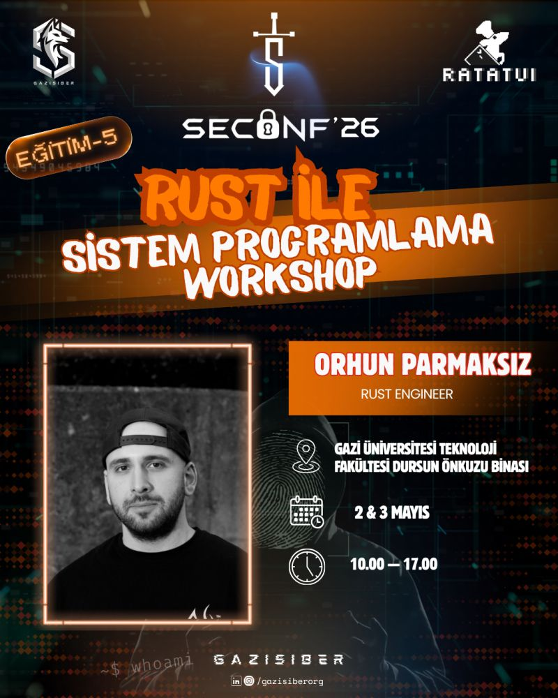

<!-- no_footer -->

<!-- end_slide -->

<!-- column_layout: [1, 1] -->

<!-- column: 0 -->

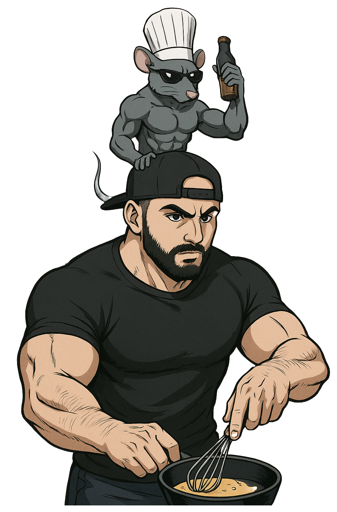

<!-- column: 1 -->

<!-- new_lines: 2 -->

# **Orhun Parmaksız**

⚡ Open Source Developer

🦀 _Open source, Rust and terminals!_

🐭 Lead maintainer @ **Ratatui**

📦 Maintainer @ **Arch Linux** (btw)

---

`https://github.com/orhun`  
`https://youtube.com/@orhundev`

<!-- end_slide -->

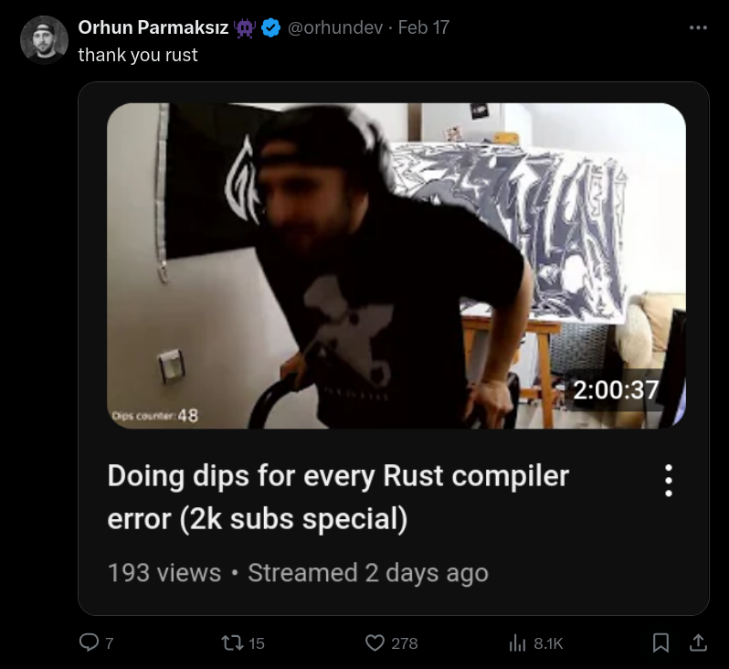

<!-- no_footer -->

<!-- end_slide -->

<!-- new_lines: 3 -->

<!-- column_layout: [1, 1]-->

<!-- column: 0 -->

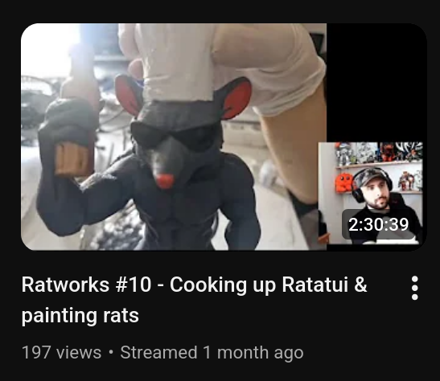

<!-- column: 1 -->

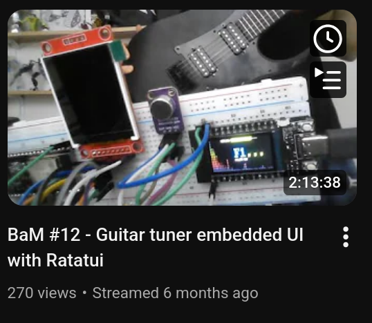

<!-- no_footer -->

<!-- end_slide -->

## Questions

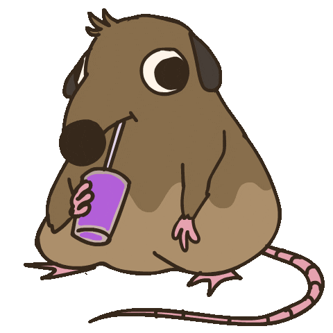

<!-- alignment: center -->

<!-- pause -->

How many of you know about Rust?

<!-- pause -->

How many of you write Rust?

<!-- pause -->

How many of you write terminal applications?

<!-- end_slide -->

<!-- alignment: center -->

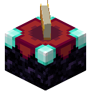

<!-- new_lines: 1 -->

## Chapter 0x1

#### Why Rust?

<!-- no_footer -->

<!-- end_slide -->

# System Programming

- Writing software that interacts directly with the OS or hardware

<!-- pause -->

<!-- column_layout: [1, 1] -->

<!-- column: 0 -->

## Examples

- Terminal tools (👑)
- Operating systems
- Embedded firmware
- Package managers
- Databases
- Compilers

<!-- pause -->

<!-- column: 1 -->

## Challenges

- Memory safety
- Undefined behavior
- Resource leaks
- Debugging at low level

<!-- reset_layout -->

<!-- pause -->

> Segmentation fault (core dumped)
>
> malloc(): corrupted top size
>
> \*\*\* stack smashing detected \*\*\*

<!-- end_slide -->


<!-- no_footer -->

<!-- end_slide -->

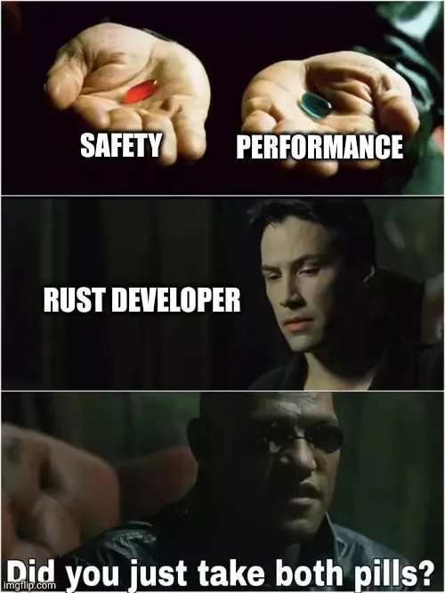

<!-- no_footer -->

<!-- end_slide -->

# What's wrong with this code? (1/5)

```c {1-12|5|7|9|11|1-12|11} +line_numbers
#include <stdlib.h>
#include <stdio.h>

int main() {
    int *p = malloc(sizeof(int));

    *p = 42;

    free(p);

    printf("%d\n", *p);
}
```

<!-- pause -->

<!-- alignment: center -->

Memory freed. Pointer still used.

<!-- end_slide -->

## **Ownership** 🦀

```rust {1-5|3-4} +line_numbers
fn main() {
    let x = Box::new(42);
    drop(x);
    println!("{}", x);
}
```

<!-- pause -->

```
error[E0382]: borrow of moved value: `x`
2 |     let x = Box::new(42);
3 |     drop(x);
  |          - value moved here
4 |     println!("{}", x);
  |                    ^ value borrowed here after move
```

Prevents `use-after-free`, eliminates dangling pointers at compile time.

<!-- end_slide -->

## **Ownership** 🦀 _(but make it make sense)_

<!-- column_layout: [1, 1] -->

<!-- column: 0 -->


<!-- column: 1 -->

<!-- new_lines: 2 -->

Every value has **one owner**.

<!-- pause -->

The owner holds the cup.

<!-- pause -->

Owner leaves the room → cup goes in the bin. 🗑️

<!-- pause -->

Hand the cup to someone else → **you don't have a cup anymore.**

<!-- end_slide -->

## **Ownership** 🦀 _(the move)_

```rust {1-5|3|4} +line_numbers
fn main() {
    let cheese = String::from("🧀");
    let stolen = cheese;
    println!("{}", cheese);
}
```

<!-- pause -->

```
error[E0382]: borrow of moved value: `cheese`
4 |     println!("{}", cheese);
  |                    ^^^^^^ value borrowed here after move
```

<!-- pause -->

<!-- alignment: center -->

You gave the cheese away.

You don't have cheese anymore. 🐭💔

<!-- end_slide -->

## Your turn 🐭

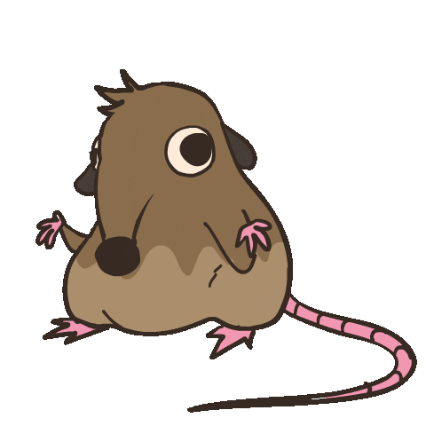

<!-- alignment: center -->

Make this compile. **Two ways.**

```rust +line_numbers
fn main() {
    let cheese = String::from("🧀");
    let stolen = cheese;
    println!("{}", cheese);
}
```

<!-- pause -->

<!-- column_layout: [1, 1] -->

<!-- column: 0 -->

### Option A: share it

```rust
let stolen = &cheese;
```

<!-- column: 1 -->

### Option B: make a copy

```rust
let stolen = cheese.clone();
```

<!-- reset_layout -->

<!-- pause -->

<!-- alignment: center -->

_(foreshadowing the next chapter 👀)_

<!-- end_slide -->

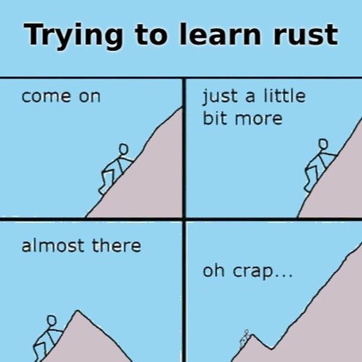

<!-- no_footer -->

<!-- end_slide -->

# What's wrong with this code? (2/5)

```c {1-16|6,14,15} +line_numbers
#include <pthread.h>

int counter = 0;

void* inc(void* _) {
    counter++;
    return NULL;
}

int main() {
    pthread_t t1, t2;
    pthread_create(&t1, NULL, inc, NULL);
    pthread_create(&t2, NULL, inc, NULL);
    pthread_join(t1, NULL);
    pthread_join(t2, NULL);
}
```

<!-- pause -->

<!-- alignment: center -->

Data race. Undefined behavior.

<!-- end_slide -->

## **Borrowing Rules** 🦀

```rust {1-5|3|4} +line_numbers
fn main() {
    let mut x = 0;
    let r1 = &mut x;
    let r2 = &mut x;
}
```

<!-- pause -->

```
error[E0499]: cannot borrow `x` as mutable more than once at a time
3 |     let r1 = &mut x;
4 |     let r2 = &mut x;
  |              ^^^^^^ second mutable borrow occurs here
```

<!-- alignment: center -->

Only one mutable reference at a time.  
Prevents aliasing-based race conditions at compile time.

<!-- end_slide -->

## **Borrowing** 🦀 _(but make it make sense)_

<!-- column_layout: [1, 1] -->

<!-- column: 0 -->

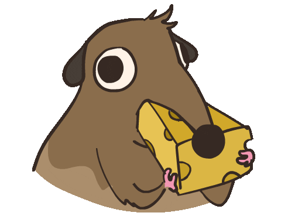

<!-- column: 1 -->

<!-- new_lines: 1 -->

The rat owns the cheese. 🧀

<!-- pause -->

You can **look** at it.  → `&cheese`

<!-- pause -->

A whole crowd can look at once. 👀👀👀

<!-- pause -->

But only **one** rat can take a bite. → `&mut cheese`

<!-- pause -->

And nobody else may even glance while it bites. 🚫

<!-- end_slide -->

## **Borrowing** 🦀 _(the classic trap)_

```rust {1-7|4|5} +line_numbers
fn main() {
    let mut snacks = vec!["🧀", "🥓", "🍞"];
    for snack in &snacks {
        if snack == &"🧀" {
            snacks.push("🐭");
        }
    }
}
```

<!-- pause -->

```
error[E0502]: cannot borrow `snacks` as mutable
              because it is also borrowed as immutable
3 |     for snack in &snacks {
  |                  ------- immutable borrow occurs here
5 |             snacks.push("🐭");
  |             ^^^^^^^^^^^^^^^^^ mutable borrow occurs here
```

<!-- pause -->

<!-- alignment: center -->

You can't rearrange the buffet while someone's eating from it. 🍽️

<!-- end_slide -->

## Your turn 🐭


<!-- alignment: center -->

Why won't this compile? **Spot the rule it breaks.**

```rust +line_numbers
fn main() {
    let mut name = String::from("Ratatui");
    let r = &name;
    name.push_str(" 🐭");
    println!("{}", r);
}
```

<!-- pause -->

<!-- column_layout: [1, 1] -->

<!-- column: 0 -->

### The rule

Can't mutate while  
something is reading.

<!-- column: 1 -->

### The fix

Use `r` **before** mutating,  
or clone it.

<!-- reset_layout -->

<!-- pause -->

<!-- alignment: center -->

_(but wait — how does the compiler know when the borrow ends? 👀)_

<!-- end_slide -->

# What's wrong with this code? (3/5)

```c {1-4|3} +line_numbers
int* foo() {
    int x = 10;
    return &x;
}
```

<!-- pause -->

<!-- alignment: center -->

RIP `x` 💀

Returning address of a local variable.

`x` is destroyed after function returns.

<!-- end_slide -->

## **Lifetimes** 🦀

```rust {1-4|2-3} +line_numbers
fn foo() -> &i32 {
    let x = 10;
    &x
}
```

<!-- pause -->

```
error[E0106]: missing lifetime specifier
error[E0515]: cannot return reference to local variable `x`
3 |     &x
  |     ^^ returns a reference to data owned by the current function
```

<!-- alignment: center -->

References cannot outlive the data they point to.

<!-- end_slide -->

## **Lifetimes** 🦀 _(but make it make sense)_

<!-- column_layout: [1, 1] -->

<!-- column: 0 -->


<!-- column: 1 -->

<!-- new_lines: 1 -->

A reference is a finger 👉 pointing at something.

<!-- pause -->

It's only valid while the thing it points to **still exists**.

<!-- pause -->

If the thing disappears... your finger points at nothing. 👻

<!-- pause -->

A **lifetime** is just _how long the compiler can prove the thing is still there._

<!-- pause -->

That's it. That's the whole concept. 🐭

<!-- end_slide -->

## **Lifetimes** 🦀 _(the dangling finger)_

```rust {1-8|3-6|5|7} +line_numbers
fn main() {
    let r;
    {
        let cheese = String::from("🧀");
        r = &cheese;
    }
    println!("{}", r);
}
```

<!-- pause -->

```
error[E0597]: `cheese` does not live long enough
5 |         r = &cheese;
  |             ^^^^^^^ borrowed value does not live long enough
6 |     }
  |     - `cheese` dropped here while still borrowed
7 |     println!("{}", r);
  |                    - borrow later used here
```

<!-- pause -->

<!-- alignment: center -->

The cheese is gone. The finger still points. 👉👻

<!-- end_slide -->

## Your turn 🐭


<!-- alignment: center -->

**Where does the cheese die?** Make it compile.

```rust +line_numbers
fn main() {
    let r;
    {
        let cheese = String::from("🧀");
        r = &cheese;
    }
    println!("{}", r);
}
```

<!-- pause -->

<!-- column_layout: [1, 1] -->

<!-- column: 0 -->

### Option A: keep cheese alive

Move `let cheese` to  
the **outer** scope.

<!-- column: 1 -->

### Option B: don't outlive it

Move `println!` **inside**  
the inner scope.

<!-- reset_layout -->

<!-- pause -->

<!-- alignment: center -->

_(good news: most of the time you never write `'a` by hand — the compiler infers it 🐭✨)_

<!-- end_slide -->

# What's wrong with this code? (4/5)

```c {1-8|4,8} +line_numbers
#include <stdio.h>

int main() {
    FILE* f = fopen("data.txt", "r");
    if (!f) return 1;

    return 0;
}
```

<!-- pause -->

<!-- alignment: center -->

File opened.
Never closed.
Resource leak.

<!-- end_slide -->

## **Drop (RAII)** 🦀

```rust {1-6|4,6} +line_numbers
use std::fs::File;

fn main() -> std::io::Result<()> {
    let _f = File::open("data.txt")?;
    Ok(())
}
```

<!-- pause -->

<!-- alignment: center -->

File is automatically closed when `_f` goes out of scope.

Deterministic cleanup. No forgotten `fclose()`.

No garbage collector!
No manual memory management!

<!-- end_slide -->

## **Drop** 🦀 _(but make it make sense)_

<!-- column_layout: [1, 1] -->

<!-- column: 0 -->


<!-- column: 1 -->

<!-- new_lines: 1 -->

When a value leaves the scope, Rust runs **cleanup** for it.

<!-- pause -->

The rat doesn't have to remember.

<!-- pause -->

The kitchen cleans itself. 🧹

<!-- pause -->

No `free`. No `fclose`. No `defer`. No GC pause.

<!-- pause -->

Just `}`.

<!-- end_slide -->

## **Drop** 🦀 _(wait, you can hook into this?)_

```rust {1-12|3-7|10|12} +line_numbers
struct Rat;

impl Drop for Rat {
    fn drop(&mut self) {
        println!("🐭 rat leaves the kitchen");
    }
}

fn main() {
    let _r = Rat;
    println!("👨‍🍳 cooking...");
}
```

<!-- pause -->

```
👨‍🍳 cooking...
🐭 rat leaves the kitchen
```

<!-- pause -->

<!-- alignment: center -->

Cleanup runs **at the closing brace**, automatically, in reverse order.

That's how `File`, `Vec`, `MutexGuard`, `TcpStream` all work. 🪄

<!-- end_slide -->

## Your turn 🐭


<!-- alignment: center -->

**What gets printed, and in what order?**

```rust +line_numbers
fn main() {
    let _a = Rat("A");
    {
        let _b = Rat("B");
        let _c = Rat("C");
    }
    let _d = Rat("D");
}
```

<!-- pause -->

```
🐭 C leaves
🐭 B leaves
🐭 D leaves
🐭 A leaves
```

<!-- pause -->

<!-- alignment: center -->

Inner scope ends first. Within a scope, **last in, first out.** 📚

_(yes, it's a stack — that's the whole trick 🐭)_

<!-- end_slide -->

# What's wrong with this code? (5/5)

```c {1-10|4,9} +line_numbers
#include <stdio.h>

int main() {
    FILE* f = fopen("data.txt", "r");

    char buf[16];
    fgets(buf, sizeof(buf), f);

    printf("%s\n", buf);
}
```

<!-- pause -->

<!-- alignment: center -->

`fopen` may return NULL.  
Error ignored.  
Crash later.

<!-- end_slide -->

## **Result & Type System** 🦀

```rust {1-6|4} +line_numbers
use std::fs::File;

fn main() {
    let f = File::open("data.txt");
}
```

<!-- pause -->

<!-- alignment: center -->

```
expected enum `Result<File, std::io::Error>`
```

You must handle the error:

```rust
let f = File::open("data.txt")?;
```

Errors are part of the type system.  
You cannot "forget" them.

<!-- end_slide -->

## **Result** 🦀 _(but make it make sense)_

<!-- column_layout: [1, 1] -->

<!-- column: 0 -->

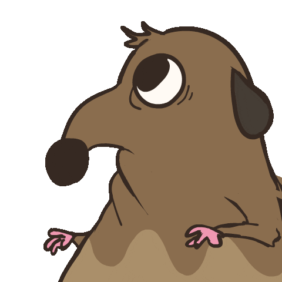

<!-- column: 1 -->

<!-- new_lines: 1 -->

A function that can fail returns a **box with two slots**:

<!-- pause -->

🧀 `Ok(value)` — here's your cheese.

<!-- pause -->

🐱 `Err(reason)` — there's a cat. sorry.

<!-- pause -->

You **must** look inside before you can use it.

<!-- pause -->

No exceptions. No silent failures. No "oh I forgot that could fail." 🚫

<!-- end_slide -->

## **Result** 🦀 _(the `?` operator)_

The verbose way:

```rust {1-6|2-5} +line_numbers
fn read_data() -> Result<String, std::io::Error> {
    let s = match std::fs::read_to_string("data.txt") {
        Ok(s) => s,
        Err(e) => return Err(e),
    };
    Ok(s)
}
```

<!-- pause -->

The same thing, with `?`:

```rust {1-4|2} +line_numbers
fn read_data() -> Result<String, std::io::Error> {
    let s = std::fs::read_to_string("data.txt")?;
    Ok(s)
}
```

<!-- pause -->

<!-- alignment: center -->

`?` means: **if `Err`, bail out. if `Ok`, unwrap and keep going.**

The rat is happy. 🐭✨

<!-- end_slide -->

## Your turn 🐭


<!-- alignment: center -->

This won't compile. **Why?** And how would you fix it?

```rust +line_numbers
fn main() {
    let s = std::fs::read_to_string("count.txt");
    println!("length is {}", s.len());
}
```

<!-- pause -->

`s` isn't a `String` — it's a `Result<String, _>`. You have to open the box first. 📦

<!-- pause -->

<!-- column_layout: [1, 1] -->

<!-- column: 0 -->

### Option A: match it

```rust
match s {
    Ok(s) => println!("{}", s.len()),
    Err(e) => eprintln!("oops: {e}"),
}
```

<!-- column: 1 -->

### Option B: use `?`

```rust
fn main() -> std::io::Result<()> {
    let s = std::fs::read_to_string("count.txt")?;
    println!("{}", s.len());
    Ok(())
}
```

<!-- reset_layout -->

<!-- pause -->

<!-- alignment: center -->

_(there's also `Option<T>` for "maybe a value" — same shape, same `?` 🐭)_

<!-- end_slide -->

## **Option** 🦀 _(no more null)_

<!-- column_layout: [1, 1] -->

<!-- column: 0 -->

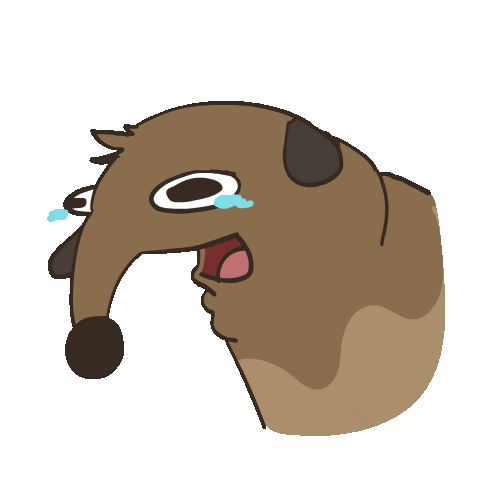

<!-- column: 1 -->

<!-- new_lines: 2 -->

> "I call it my **billion-dollar mistake.**"
>
> — Tony Hoare, on inventing null (1965)

<!-- pause -->

<!-- new_lines: 1 -->

Most languages: **any** value might secretly be `null`.

<!-- pause -->

💥 `NullPointerException`  
💥 `TypeError: undefined is not a function`  
💥 `SIGSEGV`

<!-- pause -->

<!-- new_lines: 1 -->

Rust: **there is no null.** 🚫

<!-- pause -->

If a value might be missing, it's **explicitly** wrapped:

```rust
Some("🧀")   // there's a value
None         // there isn't
```

<!-- end_slide -->

## **Option** 🦀 _(you have to look)_

```rust {1-4|2|3} +line_numbers
fn find_cheese(fridge: &[&str]) -> Option<&str> {
    if fridge.contains(&"🧀") { Some("🧀") }
    else { None }
}
```

<!-- pause -->

The compiler **refuses** to let you skip the check:

<!-- column_layout: [1, 1] -->

<!-- column: 0 -->

### `match`

```rust
match find_cheese(&fridge) {
    Some(c) => println!("got {c}"),
    None => println!("starving 🐭"),
}
```

<!-- column: 1 -->

### `if let`

```rust
if let Some(c) = find_cheese(&fridge) {
    println!("got {c}");
}
```

<!-- reset_layout -->

<!-- pause -->

<!-- alignment: center -->

Need a default? Need to bail? Same toolkit as `Result`:

```rust
let cheese = find_cheese(&fridge).unwrap_or("🥖");
let cheese = find_cheese(&fridge)?;
```

<!-- pause -->

_(no nulls. no surprises. just types. 🐭✨)_

<!-- end_slide -->

<!-- alignment: center -->

| Rust Concept | Prevents                   |
| ------------ | -------------------------- |
| Ownership    | Use-after-free             |
| Borrowing    | Data races / aliasing bugs |
| Lifetimes    | Dangling references        |
| Drop (RAII)  | Resource leaks             |
| Result       | Ignored errors             |


<!-- end_slide -->


<!-- alignment: center -->

Now you are Rust-pilled.

<!-- end_slide -->

## ☕ Break — but first, install Rust

<!-- column_layout: [2, 3] -->

<!-- column: 0 -->

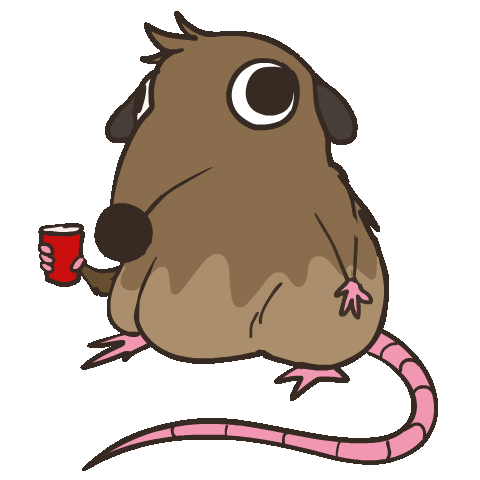

<!-- alignment: center -->

_the rat is on break._  
_so should you be._

<!-- column: 1 -->

<!-- new_lines: 1 -->

We're about to write Rust. So... **grab Rust.** 🐭

#### Linux / macOS / WSL

```bash
curl --proto '=https' --tlsv1.2 -sSf https://sh.rustup.rs | sh
```

#### Windows

Visit `https://rustup.rs` → run `rustup-init.exe`

#### Sanity check

```bash
rustc --version
cargo --version
```

<!-- reset_layout -->

<!-- pause -->

<!-- alignment: center -->

See you in **10 minutes.** ☕

_(if it's still compiling, you're in the right place.)_

<!-- end_slide -->

<!-- alignment: center -->

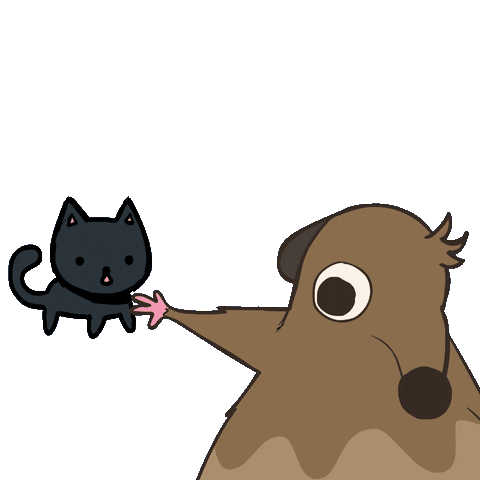

<!-- new_lines: 1 -->

## Workshop 1 🛠️

#### _Feed the Rat_

<!-- new_lines: 1 -->

~ 45 minutes

<!-- no_footer -->

<!-- end_slide -->

## What we're building 🐭

<!-- column_layout: [1, 1] -->

<!-- column: 0 -->


<!-- column: 1 -->

A tiny CLI. The rat is hungry. You feed it.

```text
🐭 the rat is hungry. (hunger: 3)
> cheese
🐭 *nibble nibble* (hunger: 2)
> bread
🐭 *crunch* (hunger: 1)
> cat
🐭 NO. NEVER. (hunger: 1)
> cheese
🐭 *burp* I'm full!
```

<!-- pause -->

<!-- new_lines: 1 -->

You'll touch: **ownership**, **`Result`/`?`**, **`enum` + `match`**, **`Option`**, **`mut`**, **`loop`**.

<!-- end_slide -->

## The plan 📋

```bash
$ cargo new feed-the-rat
$ cd feed-the-rat
```

<!-- pause -->

<!-- new_lines: 1 -->

| Step | What you build              | What you learn                |
| ---- | --------------------------- | ----------------------------- |
| 1    | read a line from stdin      | `Result`, `?`, `&mut String`  |
| 2    | parse it into a `Food` enum | `enum`, `match`, `Option`     |
| 3    | track hunger, react         | `mut`, control flow           |
| 4    | loop until full             | `loop`, `break`               |

<!-- pause -->

<!-- alignment: center -->

_(each step compiles. don't skip ahead. 🐭)_

<!-- end_slide -->

## Step 1 🐭 _read the rat's order_

```rust {1-12|5-6|7-9|10} +line_numbers
use std::io::{self, Write};

fn main() -> io::Result<()> {
    print!("> ");
    io::stdout().flush()?;

    let mut line = String::new();
    io::stdin().read_line(&mut line)?;

    println!("you said: {}", line.trim());
    Ok(())
}
```

<!-- pause -->

<!-- alignment: center -->

`?` propagates the error. `&mut line` lets `read_line` write into it.

`trim()` returns a `&str` — **borrowed**, not owned. 👀

<!-- end_slide -->

## Step 2 🐭 _name the food_

```rust {1-15|1-5|7-14} +line_numbers
enum Food {
    Cheese,
    Bread,
    Cat,
}

fn parse_food(s: &str) -> Option<Food> {
    match s {
        "cheese" => Some(Food::Cheese),
        "bread"  => Some(Food::Bread),
        "cat"    => Some(Food::Cat),
        _        => None,
    }
}
```

<!-- pause -->

<!-- alignment: center -->

The `_` arm is **mandatory** — `match` must cover every case.

The compiler will yell at you otherwise. (lovingly.) 🐭❤️

<!-- end_slide -->

## Step 3 🐭 _track the hunger_

```rust {1-12|1|3-11} +line_numbers
let mut hunger: u8 = 3;

match parse_food(line.trim()) {
    Some(Food::Cheese) => { hunger -= 1; println!("🐭 *nibble nibble*"); }
    Some(Food::Bread)  => { hunger -= 1; println!("🐭 *crunch*"); }
    Some(Food::Cat)    => println!("🐭 NO. NEVER."),
    None               => println!("🐭 ...what is that."),
}

println!("(hunger: {hunger})");
```

<!-- pause -->

<!-- alignment: center -->

`mut` is opt-in. Without it, `hunger -= 1` doesn't compile.

`match` on `Option<Food>` makes the "unknown food" case **impossible to forget.**

<!-- end_slide -->

## Step 4 🐭 _loop until full_

```rust {1-7|1|4-6} +line_numbers
loop {
    // ... prompt, read, parse, feed (steps 1-3) ...

    if hunger == 0 {
        println!("🐭 *burp* I'm full!");
        break;
    }
}
```

<!-- pause -->

<!-- alignment: center -->

That's it. You have a working Rust CLI. 🎉

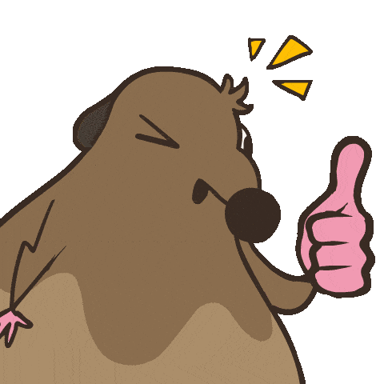

<!-- end_slide -->

## Stretch goals 🌟

If you finished early — pick one:

<!-- pause -->

🥖 **Add more foods.** What does the rat think of pizza? grapes? a whole baguette?

<!-- pause -->

📊 **Track what it ate.** Push each `Food` into a `Vec<Food>`, print a summary at the end.

<!-- pause -->

📁 **Read from a file.** `std::fs::read_to_string("menu.txt")?` — same `?`, no stdin.

<!-- pause -->

💀 **Add a "rage quit" food.** If the rat sees `cat` 3 times, it leaves. (hint: `mut`)

<!-- pause -->

<!-- alignment: center -->

_break — show & tell when we come back. 🐭_

<!-- end_slide -->

<!-- alignment: center -->


<!-- new_lines: 1 -->

## Chapter 0x2

#### Terminal applications

<!-- no_footer -->

<!-- end_slide -->

# System programming

doesn't have to mean kernels....

<!-- pause -->

Sometimes it means:

- CLI tools.
- Terminal apps.
- Developer tooling.


<!-- end_slide -->

<!-- column_layout: [2, 2, 4, 2] -->

<!-- column: 1 -->

<!-- jump_to_middle -->

**THE TERMINAL █**

<!-- column: 2 -->

<!-- new_lines: 6 -->

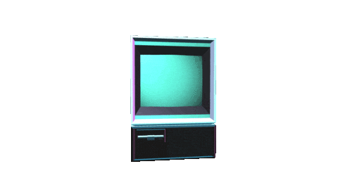

<!-- no_footer -->

<!-- end_slide -->


<!-- pause -->

```sh +exec
rio
```

<!-- end_slide -->

### It's 2026, why still terminal?

<!-- pause -->

---

<!-- column_layout: [3, 2] -->

<!-- column: 1 -->

<!-- new_lines: 2-->

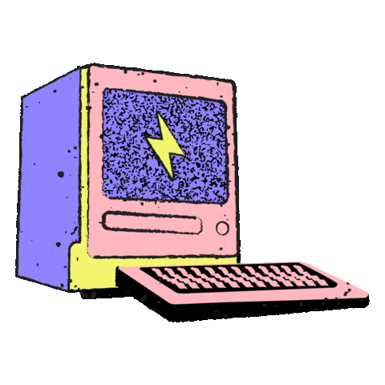

<!-- column: 0 -->

#### Timelessness

- Works the same across decades

<!-- pause -->

#### Powerful

- Your workflow, your rules
- Scripting & automation
- Endless possibilities

<!-- pause -->

#### Efficient

- Low power usage
- Runs on a potato

<!-- pause -->

<!-- reset_layout -->

<!-- column_layout: [1, 10] -->

<!-- column: 1 -->

> "Make the machine do exactly what you want with minimal friction"

<!-- end_slide -->

## "I want to download MP3 from YouTube"

<!-- new_lines: 1 -->

<!-- column_layout: [1, 1] -->

<!-- column: 0 -->

<!-- pause -->


<!-- column: 1 -->

<!-- new_lines: 6 -->

<!-- pause -->

```bash
$ yt-dlp -f bestaudio
  --extract-audio
  --audio-format mp3
  --audio-quality 0
```

<!-- end_slide -->

## "I want to search for text in files"

<!-- new_lines: 1 -->

<!-- column_layout: [1, 1] -->

<!-- column: 0 -->

<!-- pause -->

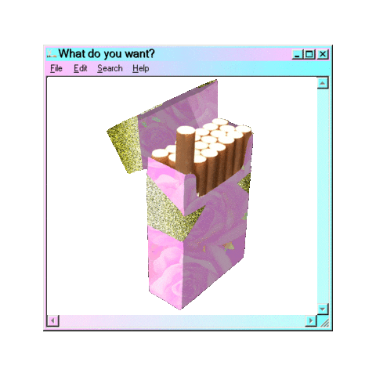

<!-- column: 1 -->

<!-- new_lines: 6 -->

<!-- pause -->

```bash +exec +acquire_terminal
ig 'fn main' /home/orhun/gh/
```

<!-- end_slide -->

## "I want to monitor my network traffic"

<!-- new_lines: 1 -->

<!-- column_layout: [1, 1] -->

<!-- column: 0 -->

<!-- pause -->

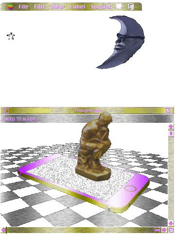

<!-- column: 1 -->

<!-- new_lines: 4 -->

<!-- pause -->

# oryx

https://github.com/pythops/oryx

```sh +exec +acquire_terminal
sudo oryx -i wlp3s0
```

<!-- end_slide -->

<!-- column_layout: [2, 2, 4, 2] -->

<!-- column: 1 -->

<!-- jump_to_middle -->

**RUST IN THE TERMINAL █**

<!-- no_footer -->

<!-- column: 2 -->

<!-- new_lines: 6 -->

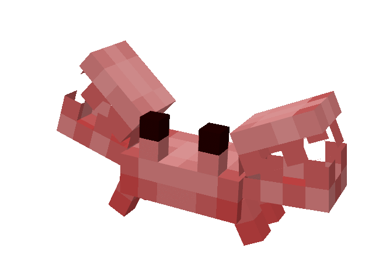

<!-- end_slide -->

## Ecosystem

<!-- pause -->

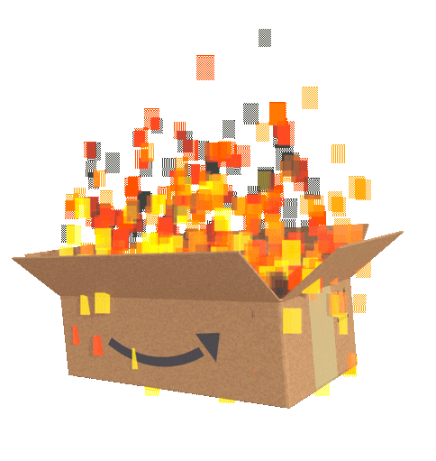

rustc, rustup, clippy, rust-analyzer, rustlings, rustfmt, rust-bindgen, cargo

<!-- pause -->

cargo-about, cargo-audit, cargo-binstall, cargo-bloat, cargo-clone, cargo-crev, cargo-deb, cargo-deny, cargo-depgraph, cargo-dist, cargo-edit, cargo-expand, cargo-generate, cargo-generate-rpm, cargo-hack, cargo-insta, cargo-llvm-cov, cargo-machete, cargo-make, cargo-modules, cargo-msrv, cargo-nextest, cargo-outdated, cargo-public-api, cargo-semver-checks...

<!-- end_slide -->

## Libraries

`https://lib.rs/command-line-interface`

<!-- pause -->

### clap: _Command Line Argument Parser_

```rust +line_numbers
use clap::Parser;

/// Simple program to greet a person
#[derive(Parser, Debug)]
#[command(version, about, long_about = None)]
struct Args {
    /// Name of the person to greet
    #[arg(short, long)]
    name: String,

    /// Number of times to greet
    #[arg(short, long, default_value_t = 1)]
    count: u8,
}
```

<!-- end_slide -->

```sh +exec +acquire_terminal
unbuffer git cliff -h | less -R
```

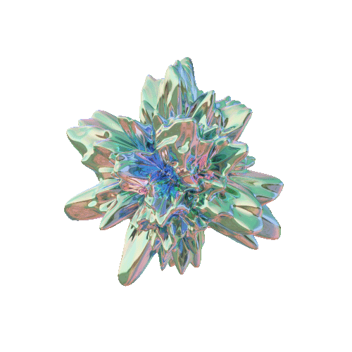

<!-- end_slide -->

### colored: _Colorize your terminal output_

<!-- pause -->

```bash
echo -e "\033[34mthis is blue\033[0m"
```

<!-- pause -->

```rust +line_numbers
use colored::Colorize;

"this is blue".blue();

"this is red".red();

"this is red on blue".red().on_blue();
```

<!-- end_slide -->

### duct: Library for running child processes

<!-- pause -->

```bash
echo out && echo err 1>&2
```

<!-- pause -->

```rust
use duct::cmd;
use std::io::{BufReader, prelude::*};;

// Merge standard error into standard output
// and read both incrementally
let out = cmd!("bash", "-c", "echo out && echo err 1>&2");
let reader = out.stderr_to_stdout().reader()?;
let mut lines = BufReader::new(reader).lines();

assert_eq!(lines.next().unwrap()?, "out");
assert_eq!(lines.next().unwrap()?, "err");
```

<!-- column_layout: [2, 1] -->

<!-- column: 1-->

<!-- pause -->

## And many more...

<!-- end_slide -->

## Demo time

Let's vibe code an app.

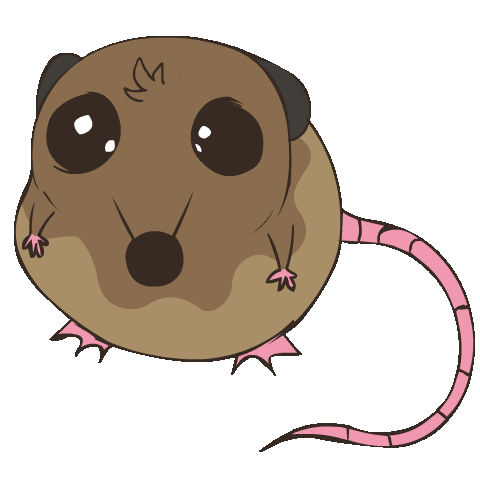

<!-- end_slide -->

<!-- alignment: center -->


<!-- new_lines: 1 -->

## Chapter 0x3

#### Ratatui

<!-- no_footer -->

<!-- end_slide -->

## Remember "oryx"?

<!-- new_lines: 1 -->

<!-- column_layout: [1, 1] -->

<!-- column: 0 -->

<!-- pause -->


<!-- column: 1 -->

<!-- new_lines: 4 -->

# oryx

https://github.com/pythops/oryx

```sh +exec +acquire_terminal
sudo oryx -i wlp3s0
```

<!-- end_slide -->


<!-- alignment: center -->

Wait... what was that? That wasn't a normal command.

<!-- pause -->

```bash +exec +acquire_terminal
htop
```

<!-- pause -->

_You run that and it shows an UI?_

<!-- pause -->

Yes, it's called a `Terminal User Interface (TUI)` ✨

<!-- end_slide -->

```svgbob
        0     1     2     3     4     5
     ┌─────┬─────┬─────┬─────┬─────┬─────┐
   0 │  A  │  n  │  k  │  a  │  r  │  a  │
     ├─────┼─────┼─────┼─────┼─────┼─────┤
   1 │     │     │     │  ▲  │     │     │
     └─────┴─────┴─────┴─ │ ─┴─────┴─────┘
                          │
                   ┌──────┴──────┐
                   │   symbol    │
                   │     "a"     │
                   └─────────────┘
```

<!-- alignment: center -->

<!-- pause -->

Unicode connecting blocks:

```
                  ─ │ ┌ ┐ └ ┘
                  ├ ┤ ┬ ┴ ┼
                  ╭ ╮ ╰ ╯
                  ▶ ▼
```

<!-- end_slide -->

```bash +exec +acquire_terminal
ghostty -e kmon
```

<!-- pause -->

```bash +exec
handlr open https://www.compart.com/en/unicode/U+2500
```

<!-- alignment: center -->

- `━` U+2501 heavy horizontal

- `┃` U+2503 heavy vertical

- `┏` `┓` `┗` `┛` heavy corners

<!-- pause -->

---

Ok cool, but how do we build these TUIs?

<!-- end_slide -->

<!-- new_lines: 2 -->


<!-- no_footer -->

<!-- end_slide -->


<!-- end_slide -->

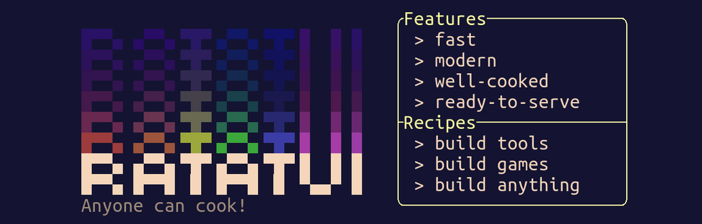

<!-- alignment: center -->

**https://ratatui.rs**

<!-- pause -->

> Ratatui is a Rust library for cooking up terminal user interfaces (TUIs).

- Been around since `2023` (fork of `tui-rs`)

- `250+` contributors, hundreds of apps, `14M+` crate downloads

- `tokio-console`, `yazi`, `dioxus-cli`, `atuin`, `gitui` & more

- Used by `Netflix`, `OpenAI`, `OVHcloud` & many more

<!-- pause -->

```bash +exec
handlr open https://ratatui.rs
```

<!-- end_slide -->

```bash +exec +acquire_terminal
cargo run --manifest-path ratatui/examples/apps/demo2/Cargo.toml
```

<!-- end_slide -->

<!-- column_layout: [1, 1] -->

<!-- column: 0 -->

## Widgets

- Block
- BarChart
- Calendar
- Canvas
- Chart
- Gauge
- LineGauge
- List
- Paragraph
- Scrollbar
- Sparkline
- Table
- Tabs
- ...

- Anything that implements `Widget` trait

<!-- column: 1 -->

<!-- pause -->

## Key Concepts

- Rendering
- Layout
- Event handling

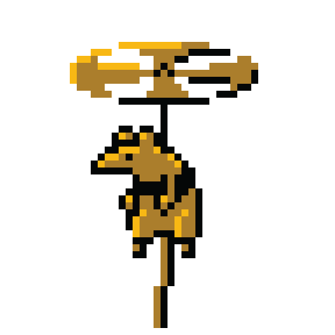

> https://ratatui.rs

<!-- end_slide -->

### Minimal Example

<!-- pause -->

```rust {1-20|5|6|7,16-18|8-11|12-14|1-20} +line_numbers
use ratatui::crossterm::event::{self, Event};
use ratatui::{text::Text, Frame};

fn main() -> std::io::Result<()> {
    let mut terminal = ratatui::init();
    loop {
        terminal.draw(draw)?;
        if matches!(event::read()?, Event::Key(_)) {
            break;
        }
    }
    ratatui::restore();
    Ok(())
}

fn draw(frame: &mut Frame) {
    frame.render_widget("Hello World!", frame.area());
}
```

<!-- end_slide -->

```rust {1-13|3}
fn main() -> Result<(), Box<dyn std::error::Error>> {
    use crossterm::event;
    ratatui::run(|terminal| loop {
        terminal.draw(|frame| {
            frame.render_widget("Hello world", frame.area())
        })?;

        if matches!(event::read()?, event::Event::Key(_)) {
            break Ok(());
        }
    })
}
```


<!-- end_slide -->

### 1. Rendering

<!-- pause -->

<!-- column_layout: [3, 1] -->

<!-- column: 0 -->

```rust {1-16|1|1,4,9|6,11|1-16} +line_numbers
let mut toggle = false;
loop {
    terminal.draw(|frame: &mut Frame| {
        if toggle {
            frame.render_widget(
                BarChart::default()
                //...
            );
        } else {
            frame.render_widget(
                LineGauge::default()
                //...
            );
        }
    });
}
```

<!-- column: 1 -->

<!-- new_lines: 7 -->


<!-- end_slide -->

### 2. Layout

<!-- pause -->

<!-- column_layout: [8, 2] -->

<!-- column: 1 -->

<!-- new_lines: 11 -->


<!-- column: 0 -->

```rust {1-9|2|3-7|1-9} +line_numbers
let layout = Layout::default()
    .direction(Direction::Horizontal)
    .constraints(&[
        Constraint::Length(10),
        Constraint::Percentage(70),
        Constraint::Min(5),
    ])
    .split(frame.area());
```

<!-- pause -->

```rust +line_numbers
let percent =
  if msg_count > 50 { 80 } else { 50 };

let contraints = &[
  Constraint::Percentage(percent),
  Constraint::Percentage(100 - percent)
];
```

<!-- end_slide -->

#### Constraints

```bash +exec +acquire_terminal
cd ratatui
cargo run -p constraint-explorer
```

<!-- pause -->

#### Flex

```bash +exec +acquire_terminal
cd ratatui
cargo run -p flex
```

<!-- end_slide -->

### 3. Event Handling

<!-- pause -->

- Backends: `crossterm`, `termion`, `termwiz`

<!-- pause -->

#### Strategies

- Centralized event handling
- Centralized catching, message passing
- Distributed event loops/segmented applications

<!-- new_lines: 1 -->

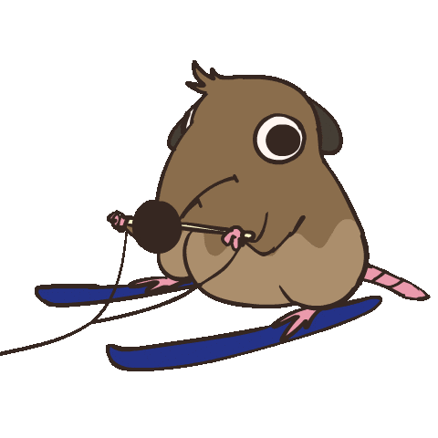

<!-- end_slide -->

```rust {1-11|1-2|6|1-11} +line_numbers
let timeout = Duration::from_secs_f64(1.0 / 60.0);
if !event::poll(timeout)? {
    return Ok(());
}

if let Event::Key(key) = event::read()? {
    match key.code {
        KeyCode::Char('q') | KeyCode::Esc => break,
        _ => {}
    }
}
```

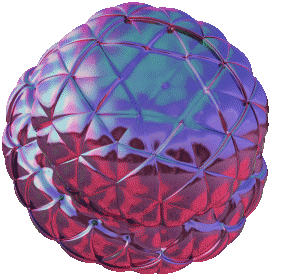

<!-- end_slide -->

```bash
$ cargo generate ratatui/templates
```


<!-- end_slide -->

# Example TUI

<!-- alignment: center -->


[](https://github.com/Julien-cpsn/ATAC)

<!-- end_slide -->

# Example TUI

<!-- alignment: center -->

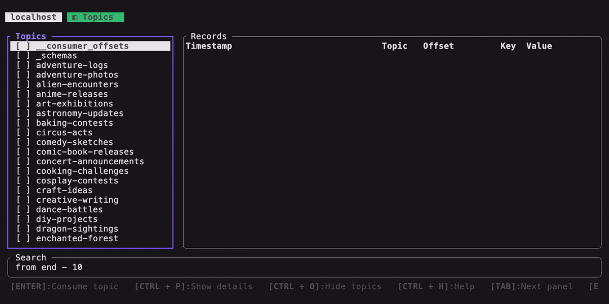

[](https://github.com/MAIF/yozefu)

<!-- end_slide -->

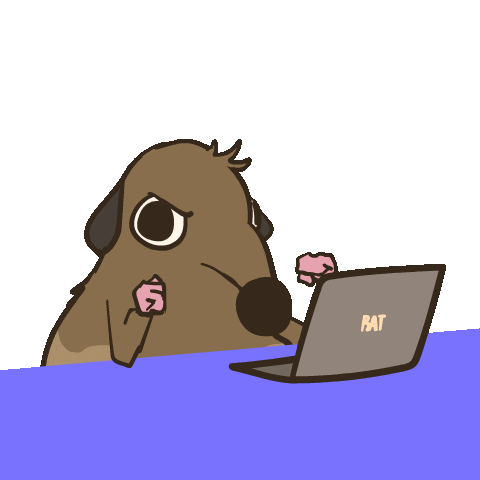

<!-- alignment: center -->

MORE!

<!-- no_footer -->

<!-- end_slide -->

# View docx files quickly

<!-- pause -->

```bash +exec +acquire_terminal
doxx assets/report.docx
```

<!-- alignment: center -->

[](https://github.com/bgreenwell/doxx)

<!-- end_slide -->

# Connect to databases

<!-- pause -->


<!-- alignment: center -->

[](https://github.com/achristmascarl/rainfrog)

<!-- end_slide -->

# Take notes

<!-- pause -->

```bash +exec +acquire_terminal
tjournal
```

<!-- alignment: center -->

[](https://github.com/AmmarAbouZor/tui-journal)

<!-- pause -->

<!-- alignment: left -->

```bash +exec +acquire_terminal
taskim
```

<!-- alignment: center -->

[](https://github.com/RohanAdwankar/taskim)

<!-- end_slide -->

# Scan for networks

<!-- pause -->

```bash +exec +acquire_terminal
sudo netscanner
```

<!-- alignment: center -->

[](https://github.com/Chleba/netscanner)

<!-- end_slide -->

# Play music

<!-- pause -->

```bash +exec
mpv assets/concertus.mp4 &> /dev/null
```

<!-- alignment: center -->

[](https://github.com/Jaxx497/concertus)

<!-- pause -->

---

```bash +exec
mpv assets/yamusic.mp4 &> /dev/null
```

[](https://github.com/yamusic/yamusic)

<!-- end_slide -->

# Bored?

<!-- pause -->

<!-- alignment: center -->

```bash +exec +acquire_terminal
rebels-in-the-sky
```

<!-- alignment: center -->

Spacepirates playing basketball across the galaxy

[](https://github.com/ricott1/rebels-in-the-sky)

<!-- pause -->

---

```bash +exec +acquire_terminal
ttysvr maze
```

<!-- end_slide -->

<!-- new_lines: 3 -->

<!-- alignment: center -->

You get the idea...


Check out `https://github.com/ratatui/awesome-ratatui` for more!

<!-- no_footer -->

<!-- end_slide -->


<!-- alignment: center -->

MORE!

<!-- no_footer -->

<!-- end_slide -->

# tachyonfx

<!-- alignment: center -->

Add shader-like effects to your terminal applications.

[](https://github.com/ratatui/tachyonfx)

---

```bash +exec +acquire_terminal
exabind
```

<!-- end_slide -->

# bevy-tui-texture

A Bevy plugin for rendering terminal UIs using Ratatui and WPGU.

[](https://github.com/tt-toe/bevy_tui_texture)

---

```bash +exec
mpv assets/bevy-tui-texture.mp4
```

<!-- end_slide -->

# ratzilla

<!-- alignment: center -->

Build terminal-themed web applications with Rust and WebAssembly.

[](https://github.com/orhun/ratzilla)


```bash +exec
handlr open https://orhun.dev/ratzilla/demo/
```

<!-- end_slide -->

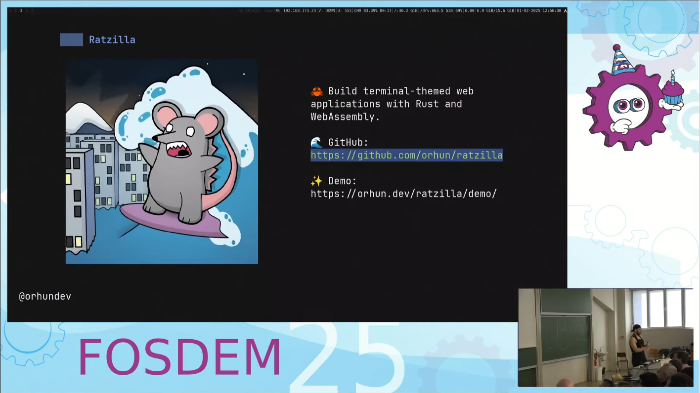

<!-- alignment: center -->

[](https://youtu.be/iepbyYrF_YQ)

<!-- end_slide -->

### Custom Backends

| Repository                          | Description                                 |
| ----------------------------------- | ------------------------------------------- |
| _ratatui_/`mousefood`               | embedded-graphics backend                   |
| _reubeno_/`tui-uefi`                | UEFI                                        |
| _Jesterhearts_/`ratatui-wgpu`       | GPU-accelerated rendering to a buffer       |
| _gold-silver-copper_/`egui_ratatui` | EGUI widget                                 |
| _gold-silver-copper_/`soft_ratatui` | Pure software rendering to arbitrary buffer |
| _cxreiff_/`bevy_ratatui_camera`     | Render Bevy app to the terminal             |
| _orhun_/`ratzilla`                  | Web                                         |


<!-- new_lines: 1 -->

<!-- end_slide -->

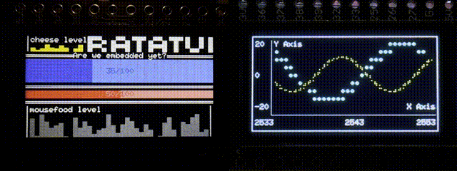

<!-- alignment: center -->

[](https://github.com/ratatui/mousefood)


<!-- end_slide -->

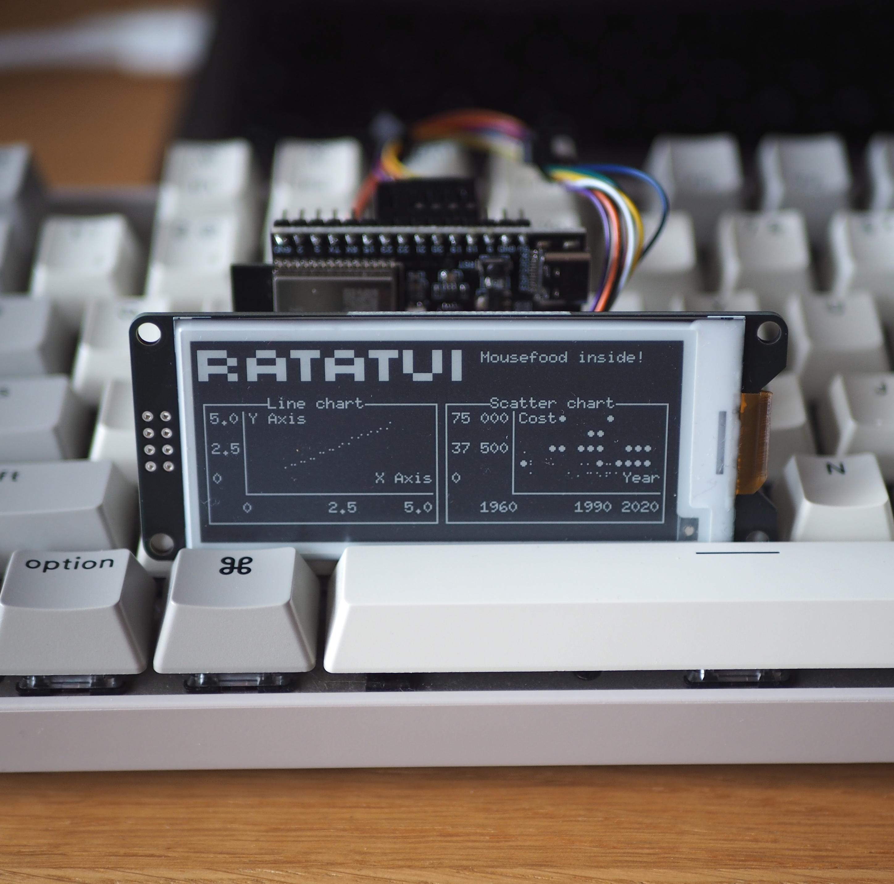

<!-- end_slide -->

```bash +exec
mpv assets/ratatui-kindle.mp4 &> /dev/null
```

<!-- end_slide -->

<!-- alignment: center -->


Ratatui on `Suzuki Baleno`  
[](https://github.com/thatdevsherry/suzui-rs)

<!-- end_slide -->

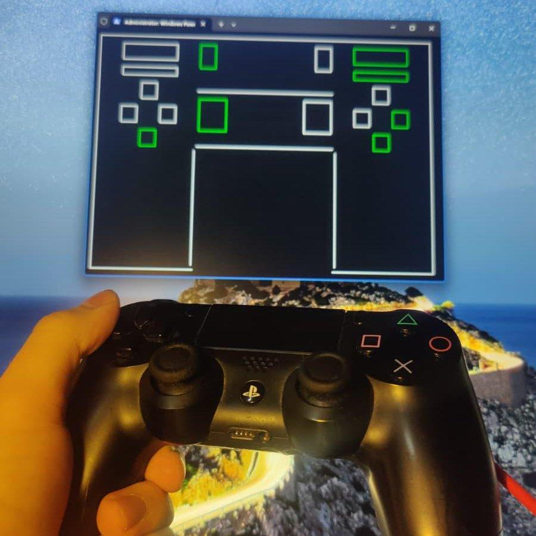

<!-- alignment: center -->

Ratatui dualshock tester

<!-- end_slide -->

<!-- new_lines: 1 -->

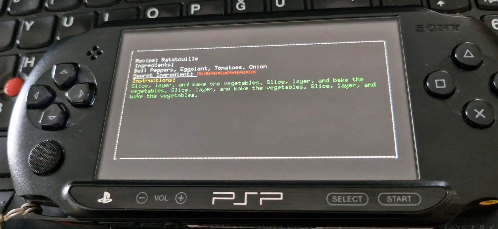

<!-- alignment: center -->

Ratatui on `PSP`  
`https://github.com/overdrivenpotato/rust-psp/pull/190`

<!-- end_slide -->

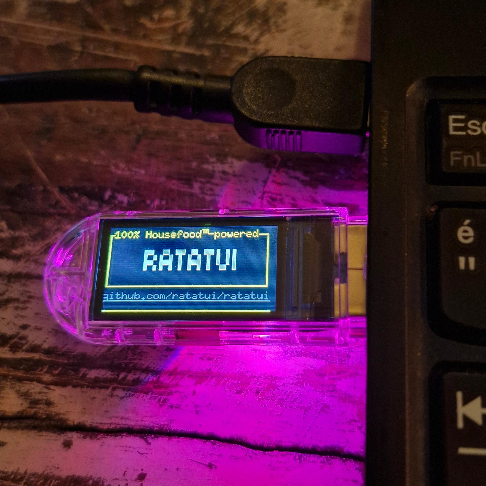

<!-- alignment: center -->

Ratatui on T-Dongle ESP32-S3

<!-- end_slide -->

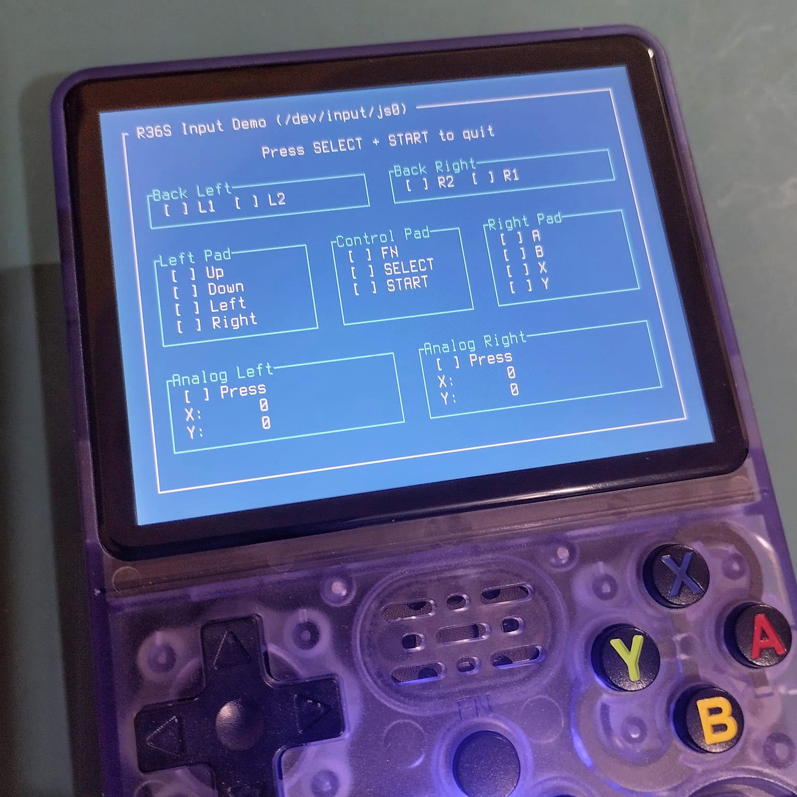

<!-- alignment: center -->

Ratatui running on the R36S console

<!-- end_slide -->

<!-- alignment: center -->

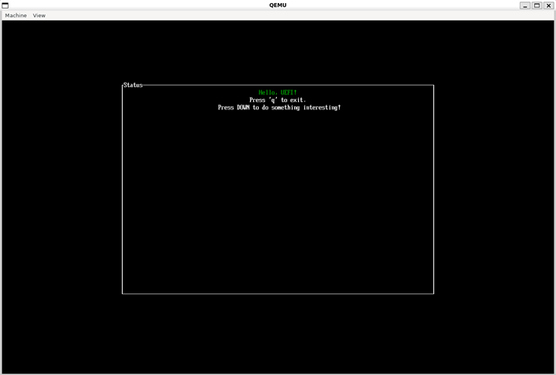

[](https://github.com/reubeno/tui-uefi)

<!-- end_slide -->

<!-- new_lines: 1 -->

We call this:

<!-- pause -->

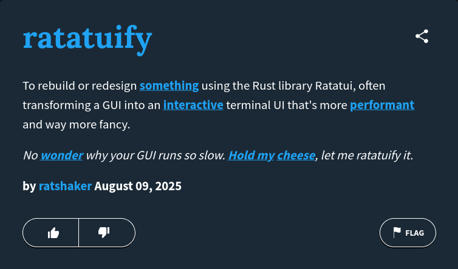

<!-- alignment: center -->

_https://www.urbandictionary.com/define.php?term=ratatuify_

<!-- end_slide -->

# Ad break


<!-- no_footer -->

<!-- end_slide -->

# Soo, what else can we do?

<!-- pause -->

Learn guitar!

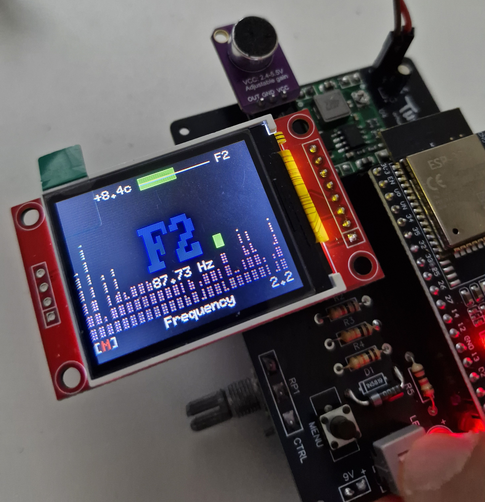

<!-- alignment: center -->

_Powered by Rust, Ratatui and 9 volt battery!_

<!-- end_slide -->

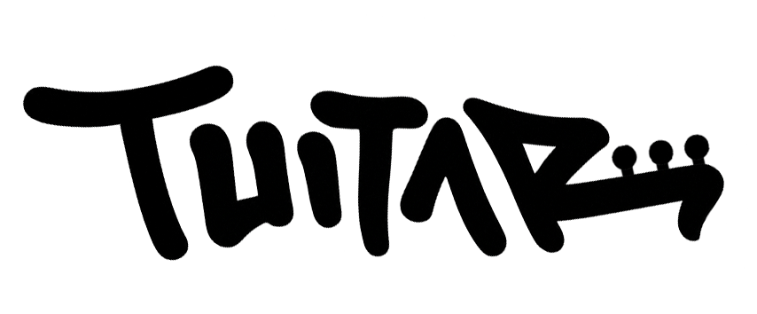

<!-- alignment: center -->

"_A portable and terminal-based guitar training tool_"

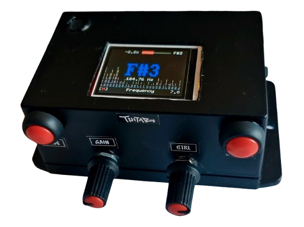

```sh +exec
mpv /home/orhun/downloads/tuitar-final.mp4
```

<!-- end_slide -->

<!-- new_lines: 1 -->

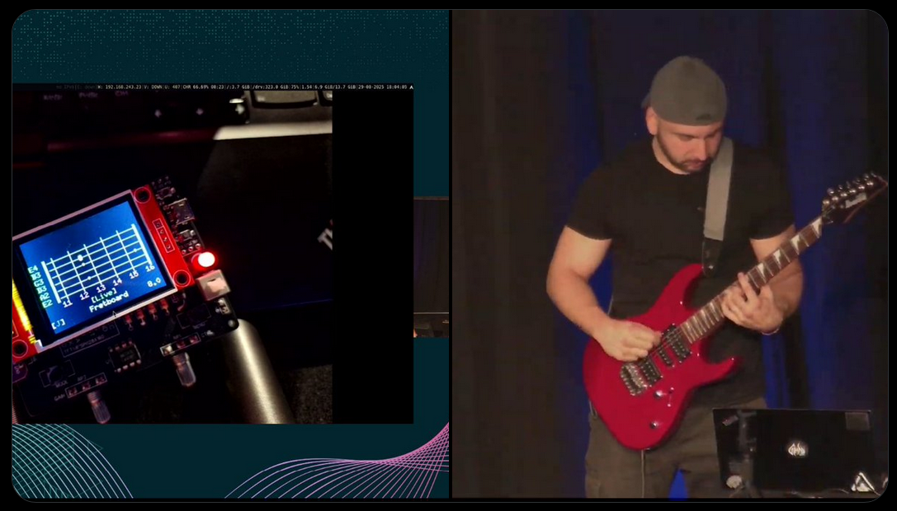

<!-- alignment: center -->

[](https://www.youtube.com/live/es48dmNWMVQ)

Live demo at Rust Forge!

<!-- end_slide -->

<!-- new_lines: 1 -->

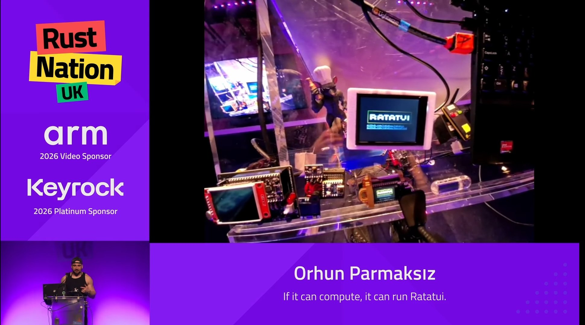

<!-- alignment: center -->

[](https://www.youtube.com/watch?v=btqNDDuZ3cI)

<!-- end_slide -->

<!-- alignment: center -->


<!-- new_lines: 1 -->

## Chapter 0x4

#### Open Source

<!-- no_footer -->

<!-- end_slide -->

### Question...


<!-- pause -->

<!-- alignment: center -->

Who the hell are you?

<!-- pause -->

Why do all of this?

<!-- pause -->

How do you survive?

<!-- end_slide -->

I just love **OPEN SOURCE**.

---

<!-- pause -->

- Software without locked doors (freedom)

<!-- pause -->

- You don't just use it. You can be part of it (community)

<!-- pause -->

- Companies die, open source lives (longevity)

<!-- pause -->

- You have the control (trust)

---

<!-- pause -->

<!-- alignment: center -->

Open source is not "free labor". It's shared ownership.

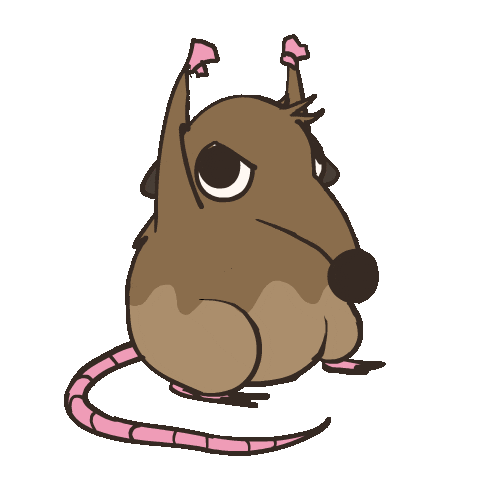

<!-- end_slide -->

<!-- new_lines: 2 -->

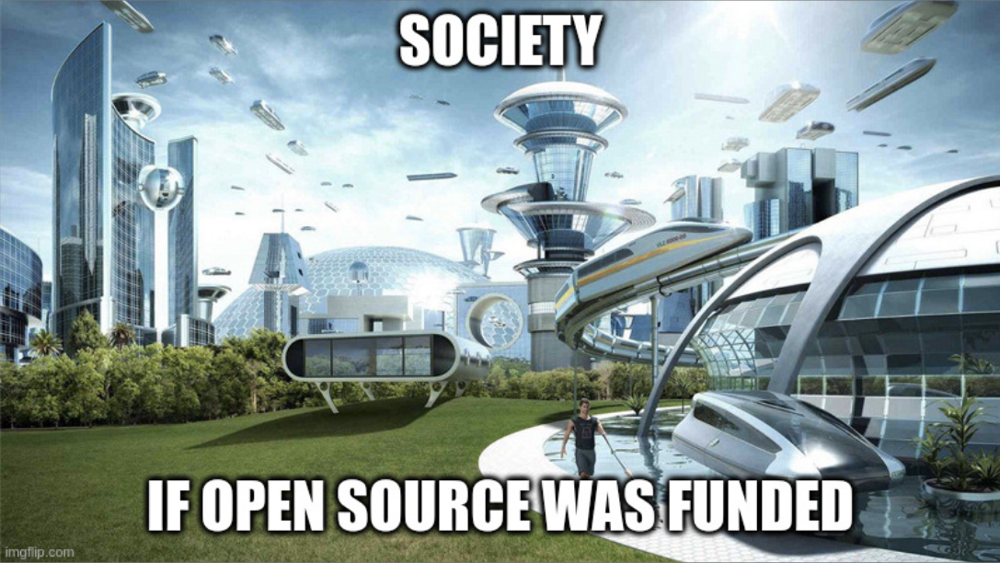

<!-- end_slide -->

Just start from somewhere...

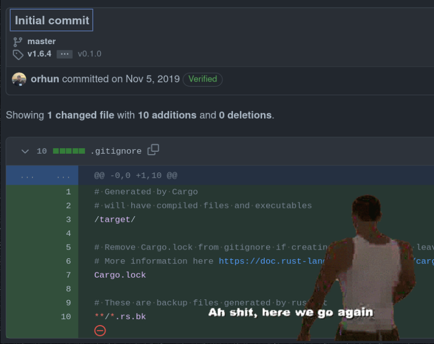

<!-- end_slide -->

### Motivation?

<!-- pause -->

_You don't need it._

<!-- pause -->

> “Open Source Grindset is the state of mind that maximizes one's effort to contribute to open source and
> increase self-improvement to deepen the technical knowledge in every possible endeavor.”

The rules of developing an `Open Source Grindset` are:

- Take your time.
- Follow the rabbit holes.
- Read and learn as much as you can.
- Every contribution is a contribution regardless of its size.

<!-- alignment: center -->

[](https://blog.orhun.dev/open-source-grindset)

👾

<!-- end_slide -->

<!-- column_layout: [1, 1] -->

<!-- column: 0 -->

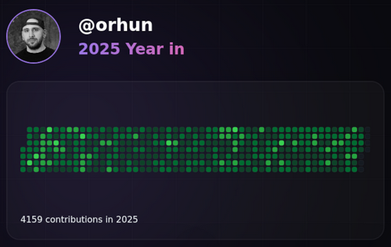

Currently on a **2581** day commit streak...


<!-- column: 1 -->

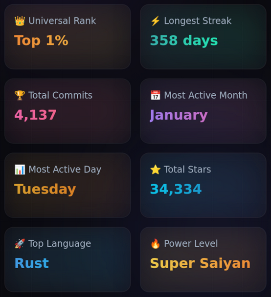

<!-- end_slide -->

### Opportunities

<!-- pause -->

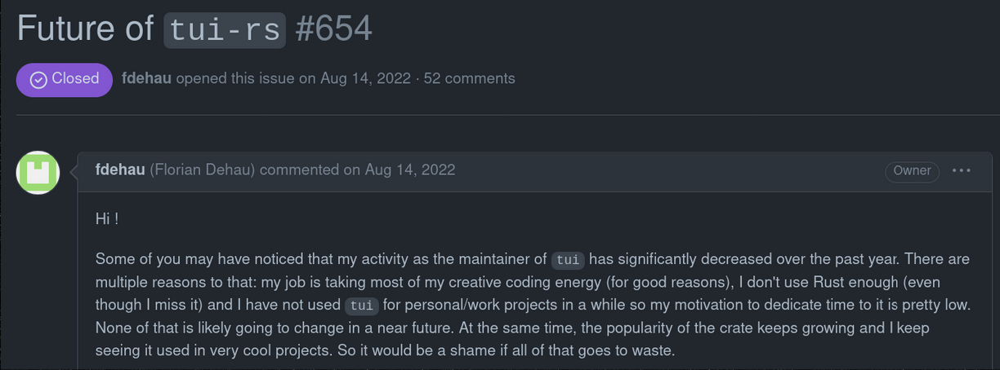

<!-- pause -->


<!-- end_slide -->


<!-- end_slide -->


<!-- end_slide -->

| Date       | Event                                                             |
| ---------- | ----------------------------------------------------------------- |
| 14-08-2022 | Discussion on the future of `tui-rs` begins.                      |
| 02-02-2023 | Discord server created to explore forking the project.            |
| 08-02-2023 | Original author proposes a plan for transferring ownership.       |
| 14-02-2023 | Fork created to continue development (`tui-rs-revival`).          |
| 18-02-2023 | First Ratatui meeting held.                                       |
| 19-03-2023 | Ratatui's first version released.                                 |
| 01-04-2023 | Second Ratatui meeting.                                           |
| 29-05-2023 | Ratatui 0.21.0 released.                                          |
| 15-07-2023 | Biggest Ratatui meeting to date!                                  |
| 17-07-2023 | Ratatui 0.22.0 released.                                          |
| 07-08-2023 | `tui-rs` archived, **Ratatui** becomes the official successor! 🎉 |


<!-- end_slide -->


<!-- alignment: center -->

[](https://blog.orhun.dev/open-source-funding-with-ratatui/)

💸

<!-- end_slide -->

Fast forward to the future...

<!-- pause -->


<!-- alignment: center -->

OpenAI's Codex got _Ratatuified_!

<!-- end_slide -->

```bash +exec +acquire_terminal
codex resume
```


<!-- end_slide -->


<!-- alignment: center -->

🐀

<!-- end_slide -->

<!-- jump_to_middle -->

Open source is more powerful than you think █

<!-- pause -->

And you can be part of it.

<!-- no_footer -->

<!-- end_slide -->

<!-- new_lines: 6 -->

### What you can do:

<!-- column_layout: [1, 1] -->

<!-- column: 1 -->


<!-- column: 0 -->

- Spread the word
- Just build stuff™

<!-- end_slide -->

Lastly...

<!-- pause -->

All the slides run in the terminal btw


<!-- end_slide -->

<!-- alignment: center -->

<!-- no_footer -->

# Thank you!


https://github.com/orhun  
https://youtube.com/orhundev

---

_P.S. I don't have a rat under my hat!_

<!-- no_footer -->
